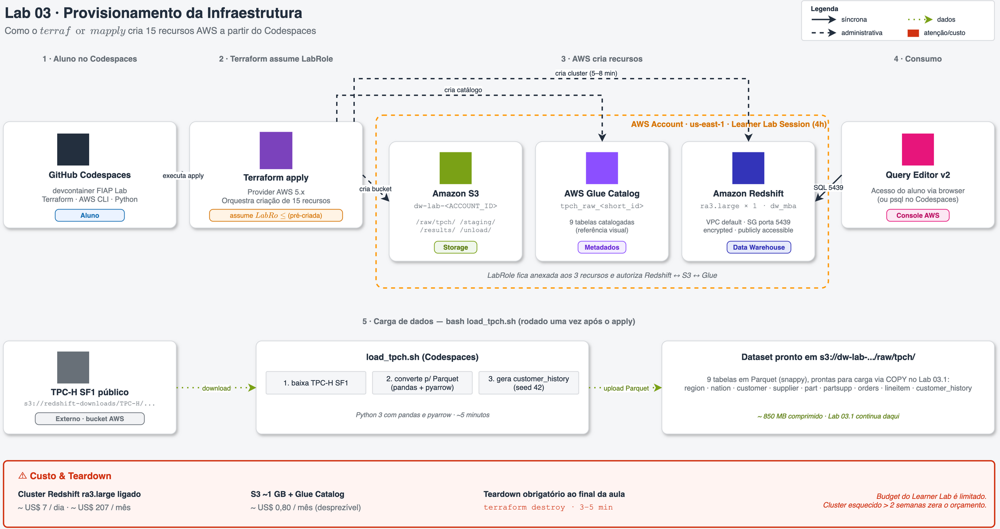

# 03 · Parte 1 — Provisionamento da infraestrutura

Este é o primeiro passo do Lab 03. Aqui o aluno sobe — via **Terraform** — toda a infraestrutura necessária para os exercícios de modelagem dimensional e Redshift. Nenhum clique em console além de copiar credenciais do AWS Academy.

> [!TIP]
> Leia primeiro a [proposta geral do Lab 03](../README.md) antes de executar este passo. Aqui o foco é **operacional**: subir, usar, pausar, destruir.

## Arquitetura



O diagrama acima resume o fluxo: (1) aluno roda `terraform apply` no Codespaces, (2) Terraform assume a `LabRole` pré-existente, (3) três recursos são criados na conta AWS (S3, Glue Catalog, Redshift), (4) aluno conecta via Query Editor v2 e (5) roda uma única vez o `load_tpch.sh` para carregar o dataset.

Fonte editável: [`img/arquitetura-provisionamento.drawio`](img/arquitetura-provisionamento.drawio) (abrir em [app.diagrams.net](https://app.diagrams.net/) ou draw.io Desktop).

---

## O que este provisionamento cria

| Recurso | Configuração | Por quê |
|---------|--------------|---------|
| **S3 Bucket** `dw-lab-<ACCOUNT_ID>` | SSE-S3, versionamento off, `force_destroy=true` | Armazena TPC-H em Parquet + resultados de `UNLOAD` |
| **Glue Catalog Database** `tpch_raw_<short_id>` | Catálogo do TPC-H para referência visual | O Learner Lab permite Glue Catalog. Spectrum **não** é usado |
| **Redshift Subnet Group** | Todas as subnets da VPC default | Learner Lab não permite criar VPC nova |
| **Security Group Redshift** | Ingress TCP 5439 do CIDR configurável (default `0.0.0.0/0`), egress liberado | Permite Codespaces e Query Editor v2 chegarem no cluster |
| **Redshift Cluster** `dw-aula3-<short_id>` | `ra3.large` × 1 nó, `publicly_accessible=true`, `encrypted=true`, `iam_roles=[LabRole]` | Único tipo de nó permitido pelo Learner Lab; 1 nó economiza budget |

> [!IMPORTANT]
> **Nenhuma IAM role é criada**. O cluster recebe a `LabRole` pré-existente do Learner Lab via `iam_roles = [data.aws_iam_role.lab_role.arn]`. Essa role tem permissão para ler o S3 do próprio bucket criado aqui, graças às policies default do Learner Lab.

---

## Pré-requisitos

- Laboratório [00 — setup](../../00-create-codespaces/README.md) concluído
- Credenciais AWS atualizadas em `~/.aws/credentials` (sessão ativa no AWS Academy)
- Codespaces rodando com o devcontainer da disciplina (já traz Terraform e AWS CLI)

Validação rápida dentro do Codespaces:

```bash
aws sts get-caller-identity
terraform version
```

Se ambos funcionarem, prossiga.

---

## Passo a passo

### 1. Subir a infraestrutura

```bash
cd 03-Data-Modeling-e-Data-Warehouse/01-provisionamento
terraform init
terraform apply
```

Tempo típico: **5 a 8 minutos** (o Redshift é o que mais demora).

O Terraform vai perguntar se você confirma (`yes`). No final, imprime outputs como:

```
redshift_endpoint = "dw-aula3-abc12345.xxxxx.us-east-1.redshift.amazonaws.com:5439"
s3_bucket_name    = "dw-lab-123456789012"
glue_database_name = "tpch_raw_12345678"
...
```

<details>
<summary><b>💡 Clique para entender: por que tantos outputs?</b></summary>
<blockquote>

Os outputs servem dois propósitos:

1. **Entregar informação ao aluno** (host, banco, usuário) sem precisar navegar no console.
2. **Alimentar o script `load_tpch.sh`** — ele lê o `terraform output` para saber em qual bucket subir os dados. Assim evitamos hardcode de nomes.

Para ver a **senha** (que é sensível e não aparece por padrão):

```bash
terraform output -raw redshift_master_password
```

</blockquote>
</details>

### 2. Carregar o dataset TPC-H

```bash
bash scripts/load_tpch.sh
```

Tempo típico: **3 a 5 minutos**. O script:

1. Lê `terraform output` para descobrir bucket e região
2. Baixa as 8 tabelas `.tbl` do TPC-H SF1 de `s3://redshift-downloads/TPC-H/2.18/1GB/` (bucket público da AWS)
3. Converte cada uma para Parquet (snappy) localmente com Python + pyarrow
4. **Gera a tabela sintética `customer_history`** — essencial para o Lab 03.1 simular SCD Tipo 2
5. Envia tudo para `s3://<bucket>/raw/tpch/<tabela>/`
6. Registra as 9 tabelas no Glue Data Catalog (para visualização no console)

<details>
<summary><b>💡 Clique para entender: o que é customer_history e por que ela é injetada?</b></summary>
<blockquote>

O TPC-H original **não tem histórico de mudanças de atributo**. Como a aula precisa exercitar SCD Tipo 2 de forma didática, o script gera uma tabela sintética:

```
customer_history
├── c_custkey        (FK para customer)
├── mktsegment_new   (novo segmento após a mudança)
└── valid_from       (data em que o novo segmento entrou em vigor)
```

O script sorteia **5% dos clientes** (semente fixa 42, todos os alunos obtêm o mesmo conjunto) e atribui a cada um uma data de mudança entre 1996-01-01 e 1998-12-31 — ou seja, **posterior ao ano 1995** que é o recorte da query-âncora do Lab 03.1.

Isso cria um cenário real: "o cliente X comprou em 1995 quando era `AUTOMOBILE`, depois virou `BUILDING` em 1997". Ao modelar com SCD Tipo 1, a venda de 1995 é reatribuída ao segmento atual (`BUILDING`). Ao modelar com SCD Tipo 2, ela permanece atribuída ao segmento da época (`AUTOMOBILE`). Os números divergem. Esse é o ponto.

</blockquote>
</details>

### 3. Conectar no Redshift

Dois caminhos suportados. Escolha um:

#### Caminho A — Query Editor v2 (recomendado)

1. No console AWS, abra **Redshift → Query Editor v2**
2. Clique no cluster `dw-aula3-<short_id>`
3. **Database user and password** → use `dwadmin` e a senha de:
   ```bash
   terraform output -raw redshift_master_password
   ```
4. Database: `dw_mba`

#### Caminho B — psql no Codespaces

```bash
PGPASSWORD="$(terraform output -raw redshift_master_password)" \
  psql -h "$(terraform output -raw redshift_host)" \
       -p 5439 \
       -U "$(terraform output -raw redshift_master_username)" \
       -d "$(terraform output -raw redshift_database)"
```

Teste inicial:

```sql
SELECT current_user, current_database(), version();
```

### 4. Prossiga para o Lab 03.1

```bash
cd ../02-modelagem-e-carga
cat README.md
```

---

## Durante a aula: pausar o cluster para economizar budget

Se a aula tem intervalo longo, **pause o cluster** em vez de deletar. Isso preserva dados e schemas, mas zera o custo de computação.

```bash
aws redshift pause-cluster \
  --cluster-identifier "$(terraform output -raw redshift_cluster_identifier)"
```

Para retomar:

```bash
aws redshift resume-cluster \
  --cluster-identifier "$(terraform output -raw redshift_cluster_identifier)"
```

> [!WARNING]
> Um cluster pausado **ainda cobra storage** (RMS no S3 gerenciado), mas não computação. O `terraform destroy` abaixo é a única forma de parar o custo completamente.

---

## Ao final da aula: destruir tudo

```bash
cd 03-Data-Modeling-e-Data-Warehouse/01-provisionamento
terraform destroy
```

Tempo típico: **3 a 5 minutos**. Remove cluster, subnet group, SG, bucket (com `force_destroy`), Glue database.

> [!CAUTION]
> **Não esqueça deste passo.** Um cluster `ra3.large` esquecido consome budget do Learner Lab rapidamente. Aluno deve rodar `terraform destroy` **antes** de fechar o Codespaces ao final da sessão.

Para confirmar que tudo foi removido:

```bash
aws redshift describe-clusters --query 'Clusters[?contains(ClusterIdentifier, `dw-aula3`)].ClusterIdentifier' --output text
aws s3 ls | grep dw-lab
aws glue get-databases --query 'DatabaseList[?starts_with(Name, `tpch_raw_`)].Name' --output text
```

Todos devem retornar vazio.

---

## Troubleshooting

### `Error: InvalidSubnet: No default VPC for this user`

Alguma conta do Learner Lab não traz VPC default. Solução:

```bash
aws ec2 create-default-vpc
```

Depois, `terraform apply` novamente.

### `Error: InvalidClusterState` ao dar destroy logo após apply

O cluster ainda está em estado `modifying` ou `available` sendo estabilizado. Espere 1 min e tente de novo.

### Query Editor v2 não conecta

Verifique:
1. O cluster está `available` (`aws redshift describe-clusters`)
2. O SG permite sua origem. Se você estiver fora do Codespaces e o `allowed_cidr_blocks` estiver em `0.0.0.0/0`, isso não deveria bloquear.
3. A senha está correta (use `terraform output -raw redshift_master_password` — copie inteiro, sem espaços).

### `load_tpch.sh` falha com `import pandas`

O script tenta instalar `pandas` e `pyarrow` via `pip`. Se o `pip` não estiver no PATH, instale manualmente:

```bash
python3 -m pip install --user pandas pyarrow
```

### Após `terraform destroy`, o bucket ainda aparece

O `force_destroy = true` deve limpar. Se não, delete manualmente:

```bash
aws s3 rb s3://$(terraform output -raw s3_bucket_name 2>/dev/null || echo dw-lab-<ACCOUNT_ID>) --force
```

---

## O que este provisionamento **não** inclui (e por quê)

| Recurso | Motivo |
|---------|--------|
| **IAM Role customizada** | Learner Lab não permite. Usamos `LabRole` pré-existente |
| **VPC / Subnets / IGW customizados** | Learner Lab não permite. Usamos a VPC default |
| **CloudTrail** | Não é parte da aula e tem restrição de CloudWatch no Learner Lab |
| **Secrets Manager para senha** | Para laboratório, senha em `terraform output` é suficiente |
| **Spectrum external schema no Redshift** | Spectrum não está listado no PDF do Learner Lab |
| **Zero-ETL integration** | Exige Aurora RDS configurada; fora de escopo |
| **Cross-region replication do S3** | Sem valor pedagógico no lab |

---

## Referências

- [Amazon Redshift Provisioned documentation](https://docs.aws.amazon.com/redshift/latest/mgmt/welcome.html)
- [`aws_redshift_cluster` Terraform resource](https://registry.terraform.io/providers/hashicorp/aws/latest/docs/resources/redshift_cluster)
- [TPC-H benchmark specification](https://www.tpc.org/tpch/)
- [AWS Academy Learner Lab restrictions](../../academy-learner-lab-aws-restrictions.pdf) (interno da disciplina)
- [Lab 03 — proposta geral](../README.md)
