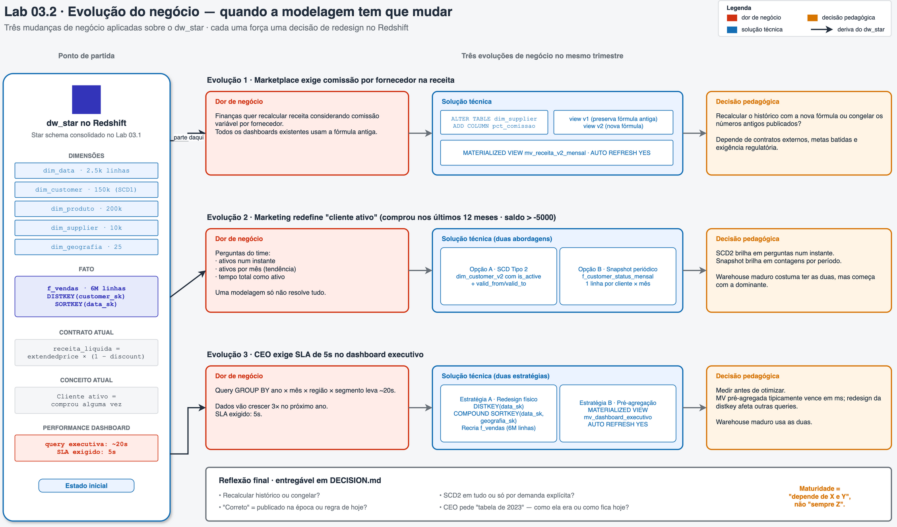

# 03.2 - Evolução do negócio: quando a modelagem tem que mudar

**Antes de começar, execute os passos abaixo para configurar o ambiente caso não tenha feito isso ainda na aula de HOJE: [Preparando Credenciais](../../00-create-codespaces/Inicio-de-aula.md)**

**Este laboratório assume que o schema `dw_star` existe e está populado** (fato `f_vendas`, dimensões `dim_customer` com SCD1, `dim_produto`, `dim_supplier`, `dim_geografia`, `dim_data`). Se você ainda não fez o [Lab 03.1](../02-modelagem-e-carga/README.md), volte e execute a Parte 3 dele. As queries deste lab consultam `dw_star.*` diretamente.

Neste laboratório, você sente na prática por que a modelagem raramente sobrevive inalterada de um trimestre para o outro. Três evoluções de negócio são aplicadas sobre o star schema do Lab 03.1, e cada uma força uma decisão de redesign.

## Arquitetura



O diagrama resume: partindo do `dw_star` consolidado no Lab 03.1 (coluna da esquerda), três evoluções de negócio chegam no mesmo trimestre. Cada linha mostra a sequência **dor de negócio → solução técnica → decisão pedagógica**: Evolução 1 acrescenta comissão na receita (views + MV versionadas), Evolução 2 redefine "cliente ativo" (SCD2 vs. fato snapshot periódico), Evolução 3 exige SLA de 5s (redesign de distkey vs. MV pré-agregada). A faixa final sintetiza as quatro perguntas da reflexão do lab.

Fonte editável: [`img/arquitetura-03-2.drawio`](img/arquitetura-03-2.drawio).

## Principais pontos de aprendizagem

- versionar fórmulas de negócio com views lado a lado
- quando usar Materialized View vs. view regular
- escolher entre SCD Tipo 2 e fato snapshot periódico
- medir `EXPLAIN ANALYZE` antes de otimizar (sem chute!)
- redistribuição vs. pré-agregação como estratégias alternativas
- ler `STL_QUERY` para tempos reais de execução

## O que você terá ao final

Ao final deste laboratório, você terá aplicado três evoluções de negócio reais sobre o warehouse, comparado estratégias de implementação e documentado os trade-offs na prática. Terminará com uma reflexão escrita sobre **"recalcular histórico ou congelar?"** — uma das perguntas centrais da maturidade de um engenheiro de dados.

> [!TIP]
> Sempre que encontrar um bloco com o título **💡 Clique para entender**, abra esse trecho. Ele traz explicação detalhada do comando, contexto prático da aula e links oficiais para aprofundamento.

---

## Contexto

Estamos em 1998, continuidade da narrativa do Lab 03.1. A empresa cresceu, e três demandas simultâneas chegam ao time de dados no mesmo trimestre:

1. **Marketplace**: abrimos vendas em marketplaces que cobram comissão variável por fornecedor. Finanças quer recalcular a receita líquida considerando essa comissão.
2. **CRM**: o time de marketing quer redefinir "cliente ativo" — não é mais "quem comprou alguma vez", é "quem comprou nos últimos 12 meses **e** tem saldo aceitável".
3. **Executivo**: o CEO cria um dashboard recorrente de receita por região × mês × segmento e exige SLA de **5 segundos**. Hoje a query leva ~20s.

Vamos atacar uma evolução de cada vez.

---

## Parte 1 - Preparação e validação do ambiente

### Resultado esperado desta parte

Ao final desta etapa, você estará conectado ao Redshift com `dw_star` acessível, e terá confirmado que os objetos do Lab 03.1 continuam disponíveis.

1. No Redshift Query Editor v2, confirme que o schema `dw_star` existe e tem as tabelas esperadas:

```sql
SELECT
    schemaname,
    tablename,
    tableowner
FROM pg_tables
WHERE schemaname = 'dw_star'
ORDER BY tablename;
```

O resultado deve conter `dim_customer`, `dim_data`, `dim_geografia`, `dim_produto`, `dim_supplier`, `f_vendas`.

<!-- PRINT SUGERIDO: img/dw_star_tables_ok.png
     Listagem das 6 tabelas do dw_star. Se faltar alguma, o aluno precisa voltar ao Lab 03.1. -->


2. Confirme que `f_vendas` tem o volume correto:

```sql
SELECT COUNT(*) AS linhas FROM dw_star.f_vendas;
```

Esperado: **6.001.215** linhas.

### Checkpoint

Se você chegou até aqui, então o ambiente do Lab 03.1 está preservado e podemos começar as evoluções.

---

## Parte 2 - Evolução 1: nova fórmula de receita

### Resultado esperado desta parte

Ao final desta etapa, a `dim_supplier` terá uma coluna `pct_comissao`, existirão duas views de receita (v1 com a fórmula antiga, v2 com a nova), e uma Materialized View com `AUTO REFRESH` pré-agregará a v2 por ano × mês × região × segmento.

3. Acrescente o atributo `pct_comissao` em `dim_supplier`. Para fins didáticos, a comissão é determinística (entre 3% e 12%) baseada em `s_suppkey`:

```sql
ALTER TABLE dw_star.dim_supplier
    ADD COLUMN pct_comissao DECIMAL(5,4) NOT NULL DEFAULT 0.0;

UPDATE dw_star.dim_supplier
SET pct_comissao = ROUND( (((s_suppkey % 10) + 3) * 1.0 / 100), 4 );

ANALYZE dw_star.dim_supplier;
```

4. Valide a distribuição das comissões:

```sql
SELECT
    pct_comissao,
    COUNT(*) AS qtd_fornecedores
FROM dw_star.dim_supplier
GROUP BY pct_comissao
ORDER BY pct_comissao;
```

<!-- PRINT SUGERIDO: img/pct_comissao_distribuicao.png
     Tabela com comissões de 0.03 a 0.12 e a quantidade de fornecedores em cada faixa.
     Deve dar ~1000 fornecedores por faixa (total 10000, 10 faixas). -->


<details>
<summary><b>💡 Clique para entender: por que ALTER TABLE é seguro aqui</b></summary>
<blockquote>

Adicionar uma coluna nullable/com default em uma tabela dimensional pequena (`dim_supplier` tem 10k linhas) é uma operação barata e reversível. O Redshift não precisa reescrever a tabela inteira.

### Quando ALTER TABLE se torna caro

- Tabelas grandes (fatos de milhões de linhas)
- Mudança de tipo de coluna (ex: `VARCHAR(10)` → `VARCHAR(50)`)
- Adição de `NOT NULL` sem default em tabela já populada

### Boa prática

Para dimensões, `ALTER TABLE ADD COLUMN` é geralmente OK. Para fatos grandes, considere recriar a tabela via `CREATE TABLE AS SELECT` com a coluna nova já presente — é mais rápido em alguns casos.

Documentação oficial:
- [ALTER TABLE no Redshift](https://docs.aws.amazon.com/redshift/latest/dg/r_ALTER_TABLE.html)

</blockquote>
</details>

5. Crie a view v1 (fórmula antiga preservada) e a view v2 (nova fórmula com comissão):

```sql
CREATE OR REPLACE VIEW dw_star.v_receita_liquida_v1 AS
SELECT
    f.data_sk,
    f.customer_sk,
    f.produto_sk,
    f.supplier_sk,
    f.geografia_sk,
    f.nr_pedido,
    f.nr_linha_pedido,
    f.qt_vendida,
    f.vl_receita_liquida       AS vl_receita_liquida,
    'v1'                       AS versao_formula
FROM dw_star.f_vendas f;

CREATE OR REPLACE VIEW dw_star.v_receita_liquida_v2 AS
SELECT
    f.data_sk,
    f.customer_sk,
    f.produto_sk,
    f.supplier_sk,
    f.geografia_sk,
    f.nr_pedido,
    f.nr_linha_pedido,
    f.qt_vendida,
    (f.vl_preco_estendido
       * (1 - f.vl_desconto_pct)
       * (1 - s.pct_comissao))   AS vl_receita_liquida,
    'v2'                         AS versao_formula
FROM dw_star.f_vendas     f
JOIN dw_star.dim_supplier s ON s.supplier_sk = f.supplier_sk;
```

6. Compare os totais para ver o impacto da comissão:

```sql
SELECT 'v1_total' AS serie, ROUND(SUM(vl_receita_liquida), 2) AS valor
FROM dw_star.v_receita_liquida_v1
UNION ALL
SELECT 'v2_total', ROUND(SUM(vl_receita_liquida), 2)
FROM dw_star.v_receita_liquida_v2;
```

<!-- PRINT SUGERIDO: img/v1_vs_v2_total.png
     Dois valores: v1_total e v2_total. v2 é menor (desconta comissão).
     A diferença percentual reflete a comissão média ponderada pela receita. -->


> [!NOTE]
> `v2_total` deve ser sempre **menor** que `v1_total` porque desconta comissão. A diferença percentual reflete a comissão média ponderada pela receita.

<details>
<summary><b>💡 Clique para entender: por que preservar a v1 em vez de substituir</b></summary>
<blockquote>

Três razões pragmáticas para manter a v1 mesmo depois da v2 existir:

1. **Dashboards antigos continuam funcionando** enquanto você comunica a mudança — nenhum gestor descobre métrica diferente sem aviso prévio.
2. **Auditoria**: se alguém perguntar "como este número foi calculado em 1997?", você mostra a v1 e a resposta é completa.
3. **Comparabilidade temporal**: se você recalcular o histórico retroativo com a v2, perde a comparação com os relatórios oficiais publicados na época.

### Boa prática: janela de coexistência

Defina uma janela de coexistência (ex: 1 trimestre) em que as duas versões ficam disponíveis. Depois desse prazo, a v1 pode ser deprecada ou ter os consumidores migrados para v2.

### Versionamento explícito

Incluir a coluna `versao_formula` na view é boa prática. Quando um consumidor salva o resultado em cache ou outro sistema, fica claro qual fórmula foi aplicada.

Documentação oficial:
- [Views no Redshift](https://docs.aws.amazon.com/redshift/latest/dg/r_Views.html)

</blockquote>
</details>

7. Crie a Materialized View da v2 para consumo recorrente em dashboards:

```sql
CREATE MATERIALIZED VIEW dw_star.mv_receita_liquida_v2_mensal
AUTO REFRESH YES
AS
SELECT
    d.nr_ano,
    d.nr_mes,
    g.nm_regiao,
    c.sg_segmento,
    SUM(
        f.vl_preco_estendido
          * (1 - f.vl_desconto_pct)
          * (1 - s.pct_comissao)
    )                                 AS vl_receita_v2,
    COUNT(*)                          AS qt_itens
FROM dw_star.f_vendas      f
JOIN dw_star.dim_data      d ON d.data_sk      = f.data_sk
JOIN dw_star.dim_geografia g ON g.geografia_sk = f.geografia_sk
JOIN dw_star.dim_customer  c ON c.customer_sk  = f.customer_sk
JOIN dw_star.dim_supplier  s ON s.supplier_sk  = f.supplier_sk
GROUP BY d.nr_ano, d.nr_mes, g.nm_regiao, c.sg_segmento;

REFRESH MATERIALIZED VIEW dw_star.mv_receita_liquida_v2_mensal;
```

8. Veja o status da MV:

```sql
SELECT
    schemaname,
    name,
    is_stale,
    autorefresh,
    state
FROM svv_mv_info
WHERE schemaname = 'dw_star'
  AND name       = 'mv_receita_liquida_v2_mensal';
```

<!-- PRINT SUGERIDO: img/mv_status_ok.png
     Linha mostrando is_stale=false, autorefresh=t, state=OK. -->


<details>
<summary><b>💡 Clique para entender: Materialized Views no Redshift</b></summary>
<blockquote>

Materialized View (MV) armazena o resultado de uma query pré-computada. A diferença crítica em relação a uma view normal:

- **View**: recalcula a cada consulta. Sempre fresca, custo alto em joins complexos.
- **MV**: materializa o resultado. Consumo em milissegundos, mas pode ficar "stale" até o próximo `REFRESH`.

### AUTO REFRESH YES

O Redshift monitora as tabelas base. Quando detecta que os dados mudaram, dispara refresh automaticamente em momentos de baixa utilização do cluster. Isso elimina a necessidade de agendamento manual.

### Limitação

MVs com `AUTO REFRESH` não podem conter certos tipos de expressão (ex: funções não-determinísticas, algumas window functions). Se o `CREATE` falhar, simplifique a query.

### Quando MV vale a pena

- Dashboards consumidos muitas vezes por dia com o mesmo corte
- Agregações pesadas sobre fatos grandes
- Consultas que caberiam em "cache" semântico

### Quando MV não compensa

- Queries ad-hoc que mudam a cada vez
- Dados que mudam em alta frequência (overhead de refresh)
- Agregações que ocupariam mais storage que a tabela base

Documentação oficial:
- [Materialized views](https://docs.aws.amazon.com/redshift/latest/dg/materialized-view-overview.html)
- [AUTO REFRESH](https://docs.aws.amazon.com/redshift/latest/dg/materialized-view-refresh.html)

</blockquote>
</details>

9. Meça o impacto da nova fórmula por ano (análise pedagógica):

```sql
WITH v1_ano AS (
    SELECT d.nr_ano, SUM(v.vl_receita_liquida) AS receita_v1
    FROM dw_star.v_receita_liquida_v1 v
    JOIN dw_star.dim_data             d ON d.data_sk = v.data_sk
    GROUP BY d.nr_ano
),
v2_ano AS (
    SELECT d.nr_ano, SUM(v.vl_receita_liquida) AS receita_v2
    FROM dw_star.v_receita_liquida_v2 v
    JOIN dw_star.dim_data             d ON d.data_sk = v.data_sk
    GROUP BY d.nr_ano
)
SELECT
    v1.nr_ano,
    ROUND(v1.receita_v1, 2)                                 AS receita_v1,
    ROUND(v2.receita_v2, 2)                                 AS receita_v2,
    ROUND(v1.receita_v1 - v2.receita_v2, 2)                 AS diferenca_abs,
    ROUND((v1.receita_v1 - v2.receita_v2) / v1.receita_v1 * 100, 2) AS diferenca_pct
FROM v1_ano v1
JOIN v2_ano v2 ON v2.nr_ano = v1.nr_ano
ORDER BY v1.nr_ano;
```

<!-- PRINT SUGERIDO: img/v1_v2_por_ano.png
     Tabela ano a ano com receita_v1, receita_v2 e a diferença percentual.
     Destaca que a diferença é relativamente estável (~7-8% em todos os anos). -->


10. Compare a performance de buscar receita via view vs. MV:

```sql
-- Via view — sempre recalcula joins
EXPLAIN
SELECT d.nr_ano, d.nr_mes, g.nm_regiao, c.sg_segmento, SUM(v.vl_receita_liquida)
FROM dw_star.v_receita_liquida_v2 v
JOIN dw_star.dim_data      d ON d.data_sk      = v.data_sk
JOIN dw_star.dim_geografia g ON g.geografia_sk = v.geografia_sk
JOIN dw_star.dim_customer  c ON c.customer_sk  = v.customer_sk
WHERE d.nr_ano = 1997
GROUP BY d.nr_ano, d.nr_mes, g.nm_regiao, c.sg_segmento;

-- Via MV — já pré-agregada
EXPLAIN
SELECT nr_ano, nr_mes, nm_regiao, sg_segmento, SUM(vl_receita_v2)
FROM dw_star.mv_receita_liquida_v2_mensal
WHERE nr_ano = 1997
GROUP BY nr_ano, nr_mes, nm_regiao, sg_segmento;
```

<!-- PRINT SUGERIDO: img/explain_view_vs_mv.png
     Dois planos lado a lado. O da view mostra múltiplos XN Hash Join. O da MV mostra apenas Aggregate + XN Seq Scan da MV. -->


### Reflexão: recalcular ou congelar?

A view v1 preserva os números antigos exatamente como foram publicados. A MV da v2 atualiza toda vez que os dados base mudam.

**Quando faz sentido recalcular histórico com regra nova**:
- A métrica não foi usada para bater meta externa
- O regulador não exige reprodutibilidade da versão publicada
- A equipe quer uma comparação temporal consistente

**Quando congelar é mais seguro**:
- A métrica foi reportada publicamente ou para conselho
- Contratos ou bônus dependem do número antigo
- Auditoria exige consultar o valor exato vigente na época

### Checkpoint

Se você chegou até aqui, então:

- `dim_supplier` tem `pct_comissao`
- as duas views coexistem
- a MV tem `AUTO REFRESH` habilitado e está `OK`
- você observou o impacto da nova fórmula ano a ano

---

## Parte 3 - Evolução 2: redefinição de "cliente ativo"

### Resultado esperado desta parte

Ao final desta etapa, você terá implementado o conceito "cliente ativo" de duas formas diferentes — como atributo SCD Tipo 2 em `dim_customer_v2` e como fato snapshot periódico `f_customer_status_mensal` — e comparado onde cada abordagem brilha ou sofre.

### A regra de negócio

```
cliente ativo = comprou nos últimos 12 meses E saldo > -5000
```

### Opção A — SCD Tipo 2 em dim_customer_v2

11. Crie a dimensão versionada. Esta abordagem modela `is_active` como um **atributo** do cliente que varia com o tempo:

```sql
CREATE TABLE dw_star.dim_customer_v2 (
    customer_v2_sk   BIGINT        NOT NULL,
    c_custkey        BIGINT        NOT NULL,
    nm_cliente       VARCHAR(25)   NOT NULL,
    sg_segmento      VARCHAR(10)   NOT NULL,
    vl_saldo         DECIMAL(15,2) NOT NULL,
    n_nationkey      INTEGER       NOT NULL,
    is_active        BOOLEAN       NOT NULL,
    valid_from       DATE          NOT NULL,
    valid_to         DATE          NOT NULL,
    is_current       BOOLEAN       NOT NULL
)
DISTKEY (c_custkey)
SORTKEY (c_custkey, valid_from);
```

12. Popule a dimensão calculando transições de status mês a mês e colapsando em intervalos:

```sql
INSERT INTO dw_star.dim_customer_v2
WITH meses AS (
    SELECT DISTINCT
        DATE_TRUNC('month', dt_completa) :: DATE AS mes_ref
    FROM dw_star.dim_data
    WHERE dt_completa BETWEEN DATE '1993-01-01' AND DATE '1998-12-31'
),
compras AS (
    SELECT
        f.customer_sk,
        c.c_custkey,
        DATE_TRUNC('month', d.dt_completa) :: DATE AS mes_compra
    FROM dw_star.f_vendas     f
    JOIN dw_star.dim_data     d ON d.data_sk     = f.data_sk
    JOIN dw_star.dim_customer c ON c.customer_sk = f.customer_sk
    GROUP BY f.customer_sk, c.c_custkey, DATE_TRUNC('month', d.dt_completa)
),
status_mensal AS (
    SELECT
        cust.c_custkey,
        m.mes_ref,
        CASE
            WHEN EXISTS (
                SELECT 1
                FROM compras cp
                WHERE cp.c_custkey = cust.c_custkey
                  AND cp.mes_compra >= DATEADD(month, -12, m.mes_ref)
                  AND cp.mes_compra <  m.mes_ref
            )
             AND cust.vl_saldo > -5000
            THEN TRUE ELSE FALSE
        END AS is_active
    FROM dw_star.dim_customer cust
    CROSS JOIN meses m
),
marcos AS (
    SELECT
        c_custkey,
        mes_ref,
        is_active,
        LAG(is_active) OVER (PARTITION BY c_custkey ORDER BY mes_ref) AS prev_status
    FROM status_mensal
),
transicoes AS (
    SELECT c_custkey, mes_ref AS valid_from, is_active
    FROM marcos
    WHERE prev_status IS NULL OR prev_status <> is_active
),
intervalos AS (
    SELECT
        c_custkey,
        valid_from,
        COALESCE(
            DATEADD(day, -1,
                LEAD(valid_from) OVER (PARTITION BY c_custkey ORDER BY valid_from)
            ),
            DATE '9999-12-31'
        ) AS valid_to,
        is_active
    FROM transicoes
)
SELECT
    ROW_NUMBER() OVER (ORDER BY i.c_custkey, i.valid_from)  AS customer_v2_sk,
    i.c_custkey,
    c.nm_cliente,
    c.sg_segmento,
    c.vl_saldo,
    c.n_nationkey,
    i.is_active,
    i.valid_from,
    i.valid_to,
    CASE WHEN i.valid_to = DATE '9999-12-31' THEN TRUE ELSE FALSE END AS is_current
FROM intervalos i
JOIN dw_star.dim_customer c ON c.c_custkey = i.c_custkey;

ANALYZE dw_star.dim_customer_v2;
```

<details>
<summary><b>💡 Clique para entender: a lógica da CTE de transições</b></summary>
<blockquote>

A estratégia aqui é clássica em data warehousing: dado um status mensal cliente × mês, **colapsar períodos consecutivos com o mesmo status** em um único intervalo `[valid_from, valid_to]`.

### Passo 1: `status_mensal`

Para cada cliente × mês, calcula TRUE/FALSE de "ativo" baseado na janela de 12 meses anteriores.

### Passo 2: `marcos` com `LAG`

Usa a função `LAG()` para pegar o status do mês anterior. Se o status mudou (ou é o primeiro mês do cliente), marca como transição.

### Passo 3: `transicoes`

Filtra apenas os meses em que houve mudança de status — esses são os pontos de início de cada intervalo.

### Passo 4: `intervalos` com `LEAD`

Usa `LEAD()` para pegar a próxima transição e calcular `valid_to = próxima transição - 1 dia`. Se não há próxima, usa `9999-12-31`.

### Custo

Este `INSERT` roda em poucos segundos mesmo com 150k clientes × 72 meses (10.8M pares). A chave é que window functions (`LAG`, `LEAD`, `ROW_NUMBER`) rodam bem paralelizadas em Redshift.

</blockquote>
</details>

13. Pergunta analítica clássica que explora a SCD2 — quantos clientes estavam ativos em 1996-06-01?

```sql
SELECT
    COUNT(*) AS clientes_ativos_19960601
FROM dw_star.dim_customer_v2
WHERE DATE '1996-06-01' BETWEEN valid_from AND valid_to
  AND is_active = TRUE;
```

<!-- PRINT SUGERIDO: img/scd2_ativos_19960601.png
     Número único mostrando clientes ativos naquela data específica. -->


### Opção B — Fato snapshot periódico

14. Agora a abordagem alternativa: modelar o mesmo conceito como **fato**, com uma linha por cliente × mês:

```sql
CREATE TABLE dw_star.f_customer_status_mensal (
    data_sk        INTEGER  NOT NULL,
    customer_sk    BIGINT   NOT NULL,
    is_active      BOOLEAN  NOT NULL,
    qt_pedidos_12m INTEGER  NOT NULL,
    vl_receita_12m DECIMAL(18,2) NOT NULL
)
DISTKEY (customer_sk)
SORTKEY (data_sk);
```

15. Popule a fato snapshot (pode levar 1-2 minutos, são ~10M linhas):

```sql
INSERT INTO dw_star.f_customer_status_mensal
WITH meses AS (
    SELECT DISTINCT
        DATE_TRUNC('month', dt_completa) :: DATE AS mes_ref,
        CAST(TO_CHAR(DATE_TRUNC('month', dt_completa), 'YYYYMMDD') AS INTEGER) AS data_sk
    FROM dw_star.dim_data
    WHERE dt_completa BETWEEN DATE '1993-01-01' AND DATE '1998-12-31'
),
agregado_12m AS (
    SELECT
        m.mes_ref,
        m.data_sk,
        c.customer_sk,
        c.vl_saldo,
        COUNT(DISTINCT f.nr_pedido) AS qt_pedidos,
        COALESCE(SUM(f.vl_receita_liquida), 0) AS vl_receita
    FROM meses m
    CROSS JOIN dw_star.dim_customer c
    LEFT JOIN dw_star.f_vendas f
      ON f.customer_sk = c.customer_sk
     AND CAST(TO_CHAR(DATE_TRUNC('month', f.dt_envio), 'YYYYMMDD') AS INTEGER)
           BETWEEN CAST(TO_CHAR(DATEADD(month, -12, m.mes_ref), 'YYYYMMDD') AS INTEGER)
               AND CAST(TO_CHAR(DATEADD(month, -1,  m.mes_ref), 'YYYYMMDD') AS INTEGER)
    GROUP BY m.mes_ref, m.data_sk, c.customer_sk, c.vl_saldo
)
SELECT
    data_sk,
    customer_sk,
    CASE WHEN qt_pedidos > 0 AND vl_saldo > -5000 THEN TRUE ELSE FALSE END AS is_active,
    qt_pedidos  AS qt_pedidos_12m,
    vl_receita  AS vl_receita_12m
FROM agregado_12m;

ANALYZE dw_star.f_customer_status_mensal;
```

16. Mesma pergunta (ativos em 1996-06-01), agora na fato snapshot:

```sql
SELECT
    data_sk,
    SUM(CASE WHEN is_active THEN 1 ELSE 0 END) AS qtd_ativos
FROM dw_star.f_customer_status_mensal
WHERE data_sk = 19960601
GROUP BY data_sk;
```

> [!TIP]
> Os dois resultados (SCD2 + snapshot) devem ser iguais dentro de diferenças de borda. Se divergirem muito, a definição de "ativo" entre as duas implementações está inconsistente.

### Comparando as abordagens

17. Rode uma pergunta que **favorece o snapshot** — evolução mensal de ativos em 3 anos:

```sql
-- Via snapshot: trivialmente rápido
SELECT
    data_sk,
    SUM(CASE WHEN is_active THEN 1 ELSE 0 END) AS qtd_ativos
FROM dw_star.f_customer_status_mensal
WHERE data_sk BETWEEN 19960101 AND 19981231
GROUP BY data_sk
ORDER BY data_sk;
```

18. Rode uma pergunta que **favorece a SCD2** — ativos AUTOMOBILE por mês de 1997:

```sql
-- Via SCD2: traz segmento + status na mesma tabela
SELECT
    DATE_TRUNC('month', f.dt_envio) :: DATE AS mes,
    COUNT(DISTINCT cv.c_custkey)            AS qtd_ativos_automobile
FROM dw_star.f_vendas f
JOIN dw_star.dim_customer_v2 cv
  ON cv.c_custkey   = (SELECT c_custkey FROM dw_star.dim_customer WHERE customer_sk = f.customer_sk)
 AND f.dt_envio BETWEEN cv.valid_from AND cv.valid_to
WHERE cv.is_active   = TRUE
  AND cv.sg_segmento = 'AUTOMOBILE'
  AND f.dt_envio BETWEEN DATE '1997-01-01' AND DATE '1997-12-31'
GROUP BY DATE_TRUNC('month', f.dt_envio)
ORDER BY mes;
```

19. Rode a pergunta onde o snapshot é imbatível — clientes ativos por pelo menos 24 meses no total:

```sql
SELECT COUNT(*) AS clientes_ativos_24m_ou_mais
FROM (
    SELECT customer_sk
    FROM dw_star.f_customer_status_mensal
    WHERE is_active
    GROUP BY customer_sk
    HAVING COUNT(*) >= 24
) t;
```

<!-- PRINT SUGERIDO: img/snapshot_vs_scd2_queries.png
     Resultados das 3 perguntas diferentes que mostram os pontos fortes de cada abordagem. -->


<details>
<summary><b>💡 Clique para entender: SCD2 vs. snapshot — como escolher</b></summary>
<blockquote>

A escolha **não é binária**. Em warehouses maduros, você acaba tendo as duas — uma para cada tipo de pergunta.

### SCD2 ganha quando

- A pergunta é sobre "estado de um cliente em um instante" (filtrar vendas pelo segmento vigente na data)
- Precisa cruzar status com outros atributos dimensionais (segmento, região)
- A frequência de mudanças é baixa (é caro ter SCD2 em um atributo que muda diariamente)

### Snapshot periódico ganha quando

- A pergunta é sobre "quantos clientes em cada estado ao longo do tempo" (tendência, churn, engajamento)
- Precisa agregar contagens em múltiplos períodos
- A frequência de snapshot é natural (diária, semanal, mensal)

### O custo de ter as duas

- **Manutenção**: dois códigos de carga que podem divergir
- **Risco semântico**: se alguém usar a dimensão e outro usar a fato, os números podem não bater
- **Governança**: bom desenho força consumo por views/MVs que garantem consistência

### Regra prática

Começar com o que responde a pergunta dominante do trimestre. Promover a outra quando aparecer demanda explícita. **Nunca** implementar as duas "por via das dúvidas" sem consumidor claro.

</blockquote>
</details>

### Checkpoint

Se você chegou até aqui, então:

- `dim_customer_v2` está populada com status versionado
- `f_customer_status_mensal` tem ~10M linhas
- você observou cenários onde cada abordagem é mais natural

---

## Parte 4 - Evolução 3: SLA de 5s no dashboard executivo

### Resultado esperado desta parte

Ao final desta etapa, você terá medido a query-alvo, testado duas estratégias de otimização (redesign físico da fato × MV pré-agregada) e documentado a decisão.

### A query-alvo

20. Esta é a query que o dashboard executivo roda hoje. Execute **3 vezes seguidas** e anote o tempo mediano (a primeira execução costuma ser mais lenta por compilação de plano):

```sql
SELECT
    d.nr_ano,
    d.nr_mes,
    g.nm_regiao,
    c.sg_segmento,
    SUM(f.vl_receita_liquida) AS receita
FROM dw_star.f_vendas      f
JOIN dw_star.dim_data      d ON d.data_sk      = f.data_sk
JOIN dw_star.dim_geografia g ON g.geografia_sk = f.geografia_sk
JOIN dw_star.dim_customer  c ON c.customer_sk  = f.customer_sk
GROUP BY d.nr_ano, d.nr_mes, g.nm_regiao, c.sg_segmento
ORDER BY d.nr_ano, d.nr_mes, g.nm_regiao, c.sg_segmento;
```

> [!TIP]
> No Query Editor v2, o tempo de execução aparece no canto inferior do painel de resultados. Anote a mediana das 3 execuções. Esse é seu **baseline**.

<!-- PRINT SUGERIDO: img/baseline_execution_time.png
     Canto inferior do Query Editor v2 mostrando "Query executed in: Xs". Esse é o baseline. -->


21. Olhe o plano da query. Procure por `DS_DIST_KEY`, `DS_BCAST_INNER` ou `DS_DIST_INNER` — são indicadores de redistribuição:

```sql
EXPLAIN
SELECT
    d.nr_ano, d.nr_mes, g.nm_regiao, c.sg_segmento, SUM(f.vl_receita_liquida)
FROM dw_star.f_vendas      f
JOIN dw_star.dim_data      d ON d.data_sk      = f.data_sk
JOIN dw_star.dim_geografia g ON g.geografia_sk = f.geografia_sk
JOIN dw_star.dim_customer  c ON c.customer_sk  = f.customer_sk
GROUP BY d.nr_ano, d.nr_mes, g.nm_regiao, c.sg_segmento;
```

<details>
<summary><b>💡 Clique para entender: os marcadores DS_* do EXPLAIN</b></summary>
<blockquote>

O Redshift precisa colocar dados relacionados no mesmo slice para executar joins. Quando não consegue, marca a operação com um "Distribution Strategy":

- **`DS_DIST_NONE`**: dados já estão alinhados (situação ótima)
- **`DS_DIST_ALL_NONE`**: tabela com `DISTSTYLE ALL` sendo unida — também ótimo
- **`DS_DIST_INNER`**: redistribui a tabela interna (pequena) — OK
- **`DS_DIST_OUTER`**: redistribui a tabela externa (maior) — caro
- **`DS_BCAST_INNER`**: broadcast da tabela inteira para todos os slices — caro se a tabela for grande
- **`DS_DIST_BOTH`**: redistribui as duas tabelas — mais caro

### O que procurar em query lenta

Se a query-alvo redistribui `f_vendas` (6M linhas), vale mudar a `DISTKEY` da fato. Se broadcasta uma dimensão grande, vale mudar a diststyle dela.

Documentação oficial:
- [Analyzing the query plan](https://docs.aws.amazon.com/redshift/latest/dg/c-analyzing-the-query-plan.html)

</blockquote>
</details>

### Estratégia A — Redesign físico da fato

22. Recrie `f_vendas` com `DISTKEY(data_sk)` e `SORTKEY` composta. A tabela antiga é preservada como backup:

```sql
ALTER TABLE dw_star.f_vendas RENAME TO f_vendas_original;

CREATE TABLE dw_star.f_vendas (
    data_sk              INTEGER       NOT NULL,
    customer_sk          BIGINT        NOT NULL,
    produto_sk           BIGINT        NOT NULL,
    supplier_sk          BIGINT        NOT NULL,
    geografia_sk         INTEGER       NOT NULL,
    nr_pedido            BIGINT        NOT NULL,
    nr_linha_pedido      INTEGER       NOT NULL,
    qt_vendida           DECIMAL(15,2) NOT NULL,
    vl_preco_estendido   DECIMAL(15,2) NOT NULL,
    vl_desconto_pct      DECIMAL(15,2) NOT NULL,
    vl_imposto_pct       DECIMAL(15,2) NOT NULL,
    vl_receita_bruta     DECIMAL(18,4) NOT NULL,
    vl_receita_liquida   DECIMAL(18,4) NOT NULL,
    vl_receita_final     DECIMAL(18,4) NOT NULL,
    fl_retornado         CHAR(1)       NOT NULL,
    fl_status_linha      CHAR(1)       NOT NULL,
    dt_envio             DATE          NOT NULL,
    dt_recebimento       DATE          NOT NULL
)
DISTKEY (data_sk)
COMPOUND SORTKEY (data_sk, geografia_sk);

INSERT INTO dw_star.f_vendas
SELECT * FROM dw_star.f_vendas_original;

ANALYZE dw_star.f_vendas;
VACUUM dw_star.f_vendas;
```

<details>
<summary><b>💡 Clique para entender: por que DISTKEY(data_sk) agora?</b></summary>
<blockquote>

No Lab 03.1, escolhemos `DISTKEY(customer_sk)` porque não sabíamos qual seria o workload dominante. Agora sabemos: o dashboard executivo **filtra e agrupa por data/região**.

### Por que DISTKEY(data_sk) ajuda

Colocar todas as vendas do mesmo mês no mesmo slice permite que o `GROUP BY nr_ano, nr_mes` aconteça localmente, sem redistribuir dados entre slices. A operação final é só `UNION ALL` dos resultados parciais.

### Trade-off

Isso **prejudica** queries que filtram por cliente específico (ex: "qual o extrato do cliente X?"), porque agora os dados de X estão espalhados. É um trade-off real.

### COMPOUND SORTKEY (data_sk, geografia_sk)

Em vez de uma única coluna de sort, usamos duas. Compound sortkey cria a ordenação por primeira coluna, depois pela segunda dentro de cada valor da primeira. Filtros por `data_sk` continuam com skipping perfeito, e filtros adicionais por `geografia_sk` ganham skipping parcial.

### Alternativa: INTERLEAVED SORTKEY

Para workload multi-dimensional onde nenhuma coluna domina, `INTERLEAVED` dá pesos iguais. Tem custo de manutenção maior (requer `VACUUM REINDEX`), então só vale em cenários específicos.

Documentação oficial:
- [Choosing sort keys](https://docs.aws.amazon.com/redshift/latest/dg/t_Sorting_data.html)
- [Distribution styles](https://docs.aws.amazon.com/redshift/latest/dg/t_Distributing_data.html)

</blockquote>
</details>

23. Rode a query-alvo novamente (3x) com a fato remodelada e anote o novo tempo:

```sql
SELECT
    d.nr_ano, d.nr_mes, g.nm_regiao, c.sg_segmento, SUM(f.vl_receita_liquida) AS receita
FROM dw_star.f_vendas      f
JOIN dw_star.dim_data      d ON d.data_sk      = f.data_sk
JOIN dw_star.dim_geografia g ON g.geografia_sk = f.geografia_sk
JOIN dw_star.dim_customer  c ON c.customer_sk  = f.customer_sk
GROUP BY d.nr_ano, d.nr_mes, g.nm_regiao, c.sg_segmento
ORDER BY d.nr_ano, d.nr_mes, g.nm_regiao, c.sg_segmento;
```

### Estratégia B — Materialized View pré-agregada

24. Agora crie uma MV com o corte exato que o dashboard consome:

```sql
CREATE MATERIALIZED VIEW dw_star.mv_dashboard_executivo
AUTO REFRESH YES
AS
SELECT
    d.nr_ano,
    d.nr_mes,
    g.nm_regiao,
    c.sg_segmento,
    SUM(f.vl_receita_liquida)    AS receita_liquida,
    SUM(f.vl_receita_final)      AS receita_final,
    SUM(f.qt_vendida)            AS qt_vendida,
    COUNT(*)                     AS qt_itens,
    COUNT(DISTINCT f.customer_sk) AS qt_clientes
FROM dw_star.f_vendas      f
JOIN dw_star.dim_data      d ON d.data_sk      = f.data_sk
JOIN dw_star.dim_geografia g ON g.geografia_sk = f.geografia_sk
JOIN dw_star.dim_customer  c ON c.customer_sk  = f.customer_sk
GROUP BY d.nr_ano, d.nr_mes, g.nm_regiao, c.sg_segmento;

REFRESH MATERIALIZED VIEW dw_star.mv_dashboard_executivo;
```

25. Agora o dashboard consulta a MV em vez da fato. Rode 3x e anote o tempo:

```sql
SELECT
    nr_ano,
    nr_mes,
    nm_regiao,
    sg_segmento,
    receita_liquida
FROM dw_star.mv_dashboard_executivo
ORDER BY nr_ano, nr_mes, nm_regiao, sg_segmento;
```

<!-- PRINT SUGERIDO: img/mv_dashboard_execution_time.png
     Tempo de execução via MV — deve ser ordens de grandeza menor que o baseline. -->


### Comparando as três medições

26. Monte a tabela mental:

| Estratégia | Tempo mediano (s) | Custo de implantação | Manutenção |
|-----------|-------------------|----------------------|------------|
| Baseline (DISTKEY customer_sk) | _______ | zero (já estava assim) | zero |
| Estratégia A (DISTKEY data_sk) | _______ | alto (recriar fato) | baixa |
| Estratégia B (MV pré-agregada) | _______ | baixo (só CREATE MV) | média (refresh + storage) |

27. Veja as últimas execuções de cada estratégia via system table:

```sql
SELECT
    CASE
        WHEN querytxt ILIKE '%mv_dashboard_executivo%' THEN 'MV pre-agregada'
        WHEN querytxt ILIKE '%dim_customer%' AND querytxt ILIKE '%dim_geografia%' THEN 'Fato'
        ELSE 'outra'
    END                                           AS estrategia,
    starttime,
    DATEDIFF(ms, starttime, endtime)              AS duracao_ms,
    SUBSTRING(querytxt, 1, 80)                    AS query_snippet
FROM stl_query
WHERE userid > 1
  AND starttime > DATEADD(hour, -1, GETDATE())
  AND querytxt NOT ILIKE '%EXPLAIN%'
  AND (
      querytxt ILIKE '%mv_dashboard_executivo%'
   OR (querytxt ILIKE '%dim_customer%' AND querytxt ILIKE '%dim_geografia%')
  )
ORDER BY starttime DESC
LIMIT 20;
```

<!-- PRINT SUGERIDO: img/stl_query_comparison.png
     Lista das últimas 20 execuções, com as duas estratégias lado a lado para comparação objetiva. -->


### Decisão recomendada

Tipicamente, a **MV pré-agregada vence por ordens de grandeza** para este caso. Ela:

- responde em milissegundos (é uma tabela pequena já calculada)
- não exige recriar 6M linhas da fato
- tem refresh automático sem intervenção humana

A mudança de DISTKEY beneficia **todo** o workload que filtre por data — não só o dashboard — mas também força re-teste de outras queries.

> [!IMPORTANT]
> Em produção, o padrão maduro combina as duas: DISTKEY adequada ao workload dominante + MVs dedicadas para top-5 dashboards.

### Rollback (opcional)

28. Se quiser voltar ao estado original do Lab 03.1, faça:

```sql
DROP TABLE dw_star.f_vendas;
ALTER TABLE dw_star.f_vendas_original RENAME TO f_vendas;
ANALYZE dw_star.f_vendas;
```

### Checkpoint

Se você chegou até aqui, então:

- você mediu o baseline com `EXPLAIN` + 3 execuções
- testou a estratégia de redistkey
- testou a estratégia de MV pré-agregada
- decidiu com base em dados reais, não em regra de polegar

---

## Parte 5 - Reflexão final

As perguntas abaixo não têm resposta única, mas têm respostas **melhores** que outras. Use-as para fechar o lab por escrito (no final do `DECISION.md` do Lab 03.1 ou em arquivo novo):

1. **"Você recalcularia o histórico com a nova fórmula de receita, ou manteria o número antigo congelado?"**
   Em que contexto a resposta muda?

2. **"O que é 'correto': o número da métrica no dia em que foi publicada, ou o número recalculado com a regra atual?"**
   Existe resposta universal, ou depende de quem está pedindo?

3. **"Se o CEO pedir 'a mesma tabela de 2023', você entrega como ela era, ou como ela fica aplicando as regras de hoje aos dados antigos?"**
   Como a modelagem ajuda a separar esses dois mundos?

4. **"Você começaria o próximo warehouse implementando SCD2 em tudo, ou SCD1 e só promoveria para SCD2 quando surgisse demanda explícita?"**
   Existe "padrão seguro"?

> [!TIP]
> A maturidade aparece em responder com "depende de X e Y" em vez de "sempre Z". Este lab é um exercício de raciocínio, não de memorização.

---

## Parte 6 - Destruindo a infraestrutura ao final da aula

### Resultado esperado desta parte

Ao final desta etapa, todos os recursos AWS criados para o Lab 03 (cluster Redshift, bucket S3, Glue Database, Security Group) terão sido removidos da sua conta, zerando o consumo de budget.

> [!CAUTION]
> **Este passo é obrigatório ao final da aula.** Um cluster Redshift `ra3.large` continua consumindo budget mesmo ocioso, e o Learner Lab tem orçamento limitado — se ultrapassar, sua conta é desativada e **todo o progresso é perdido**.

### Quanto custa deixar a infra ligada

Preços públicos AWS para a região `us-east-1` (valores de referência on-demand, 2026):

| Recurso | Preço unitário | Custo/dia (24h) | Custo/mês (720h) |
|---------|---------------|-----------------|-------------------|
| **Redshift `ra3.large` × 1 nó** | ~$0,287/hora | **~$6,89** | **~$207** |
| **Redshift Managed Storage** (dados do TPC-H) | $0,024/GB-mês | ~$0,03 | ~$0,80 |
| **S3 Standard** (~1 GB de Parquet) | $0,023/GB-mês | negligível | ~$0,02 |
| **Glue Data Catalog** (primeiros 1M objetos) | grátis | $0 | $0 |
| **Total estimado** | — | **~$7/dia** | **~$210/mês** |

> [!IMPORTANT]
> **O cluster Redshift é 99% do custo.** Um fim de semana esquecido (~72h) consome ~$21 do seu budget do Learner Lab. Uma semana inteira, ~$50. Dois fins de semana, o budget acabou.

### 28. Volte ao terminal do Codespaces

Se você estava no Redshift Query Editor v2 no browser, alterne para a aba/janela do **GitHub Codespaces**. No Codespaces, abra um terminal integrado (`Ctrl+`` ` ou menu `Terminal → New Terminal`).

<!-- PRINT SUGERIDO: img/codespaces_terminal_aberto.png
     Codespaces com um terminal aberto, mostrando o prompt pronto para executar comandos. -->


### 29. Acesse a pasta de provisionamento

A infra foi criada pelo Terraform localizado em `01-provisionamento/`. Entre nela:

```bash
cd /workspaces/FIAP-Data-Warehouse-Lakehouse-e-Data-Mesh/03-Data-Modeling-e-Data-Warehouse/01-provisionamento
```

Confirme que você está no diretório certo (deve haver `main.tf`, `variables.tf`, `outputs.tf`, `versions.tf`):

```bash
ls -la
```

### 30. Verifique o que está provisionado antes de destruir

Opcional, mas boa prática. Liste os outputs para confirmar quais recursos serão removidos:

```bash
terraform output
```

Você deve ver o `redshift_cluster_identifier`, `s3_bucket_name` e `glue_database_name`.

<!-- PRINT SUGERIDO: img/terraform_output_antes_destroy.png
     Terminal mostrando os outputs do Terraform, com os 3 recursos principais visíveis.
     É o último retrato do que existe antes do destroy. -->


### 31. Execute o destroy

```bash
terraform destroy
```

O Terraform vai listar os **15 recursos** que serão deletados e pedir confirmação. Digite `yes` e aguarde.

> [!NOTE]
> O destroy leva tipicamente **3 a 5 minutos**. O cluster Redshift é o mais demorado de destruir (~3 minutos) porque o serviço precisa liberar storage, snapshots e ENIs associadas.

<details>
<summary><b>💡 Clique para entender: o que o terraform destroy faz por baixo dos panos</b></summary>
<blockquote>

O Terraform lê o `terraform.tfstate` local, identifica todos os recursos gerenciados, calcula o grafo de dependências e destrói **na ordem inversa** da criação.

### Ordem típica de deleção

1. **Objetos S3** (prefixos `.keep`) — primeiros porque não têm dependência
2. **Security Group Rules** (ingress e egress) — antes do SG
3. **Security Group** — depois que as rules foram removidas
4. **Bucket S3** — depois que está vazio (`force_destroy = true` garante isso)
5. **Glue Database** — independente, cai junto
6. **Redshift Cluster** — o mais demorado
7. **Redshift Subnet Group** — depois que o cluster saiu
8. **random_password** — último, porque só é usado pelo cluster

### Se der erro no meio do destroy

Rode `terraform destroy` novamente. O Terraform é **idempotente** — ele só tenta destruir o que ainda existe. Causas comuns:

- Cluster Redshift em estado `modifying`: aguarde 30s e tente de novo
- Dependência temporária não liberada (ex: ENI presa): espere 1-2 min e repita
- Credenciais AWS expiradas: renove e tente novamente

Documentação oficial:
- [terraform destroy](https://developer.hashicorp.com/terraform/cli/commands/destroy)

</blockquote>
</details>

### 32. Confirme que tudo foi removido

Rode os 3 comandos abaixo. Todos devem retornar **vazio**:

```bash
# Nenhum cluster começando com "dw-aula3"
aws redshift describe-clusters \
    --query 'Clusters[?starts_with(ClusterIdentifier, `dw-aula3`)].ClusterIdentifier' \
    --output text

# Nenhum bucket começando com "dw-lab"
aws s3 ls | grep dw-lab

# Nenhum Glue database começando com "tpch_raw_"
aws glue get-databases \
    --query 'DatabaseList[?starts_with(Name, `tpch_raw_`)].Name' \
    --output text
```

<!-- PRINT SUGERIDO: img/aws_cleanup_verificado.png
     Terminal mostrando os 3 comandos acima e retorno vazio em todos.
     Essa é a prova de que a limpeza funcionou. -->


### 33. Feche o Codespaces

Finalize também a sessão de trabalho:

```bash
# Ainda no terminal do Codespaces
exit
```

Depois vá em [github.com/codespaces](https://github.com/codespaces), clique nos 3 pontinhos ao lado do ambiente e selecione **Stop Codespace**. Isso preserva suas horas gratuitas de Codespaces para a próxima aula.

### Checkpoint final

Se você chegou até aqui, então:

- o cluster Redshift foi destruído (deixa de gerar custo)
- o bucket S3 foi removido
- o Glue Database foi deletado
- o Security Group foi limpo
- o Codespaces foi parado

> [!TIP]
> Você pode recriar todo o ambiente em qualquer outra aula rodando `terraform apply` novamente — leva 5-8 minutos e reproduz exatamente o mesmo estado. Essa é a beleza de infra como código.

---

## Conclusão

Se você chegou até aqui, você aplicou:

- versionamento de fórmula de negócio com views v1/v2 coexistindo
- Materialized View com AUTO REFRESH
- SCD2 vs. fato snapshot periódico — duas modelagens para a mesma pergunta
- medição objetiva de performance com EXPLAIN + stl_query
- redesign físico da fato vs. MV dedicada como estratégias de otimização
- teardown completo da infraestrutura via `terraform destroy`

Este é o fechamento da trilha de Data Modeling + Data Warehouse. Você construiu um warehouse, sentiu as escolhas de modelagem impactarem números concretos, viu como a evolução do negócio força o modelo a se adaptar e aprendeu a limpar tudo para preservar o budget.

---

## Onde tirar os prints

| # | Arquivo | Contexto a capturar |
|---|---------|---------------------|
| 1 | `img/dw_star_tables_ok.png` | Listagem das 6 tabelas do schema `dw_star` |
| 2 | `img/pct_comissao_distribuicao.png` | 10 faixas de comissão com ~1000 fornecedores cada |
| 3 | `img/v1_vs_v2_total.png` | Totais v1 e v2 com diferença absoluta |
| 4 | `img/mv_status_ok.png` | `svv_mv_info` mostrando `is_stale=false`, `autorefresh=t` |
| 5 | `img/v1_v2_por_ano.png` | Tabela ano a ano com diferença percentual |
| 6 | `img/explain_view_vs_mv.png` | Planos de EXPLAIN lado a lado |
| 7 | `img/scd2_ativos_19960601.png` | Contagem de ativos em data específica (SCD2) |
| 8 | `img/snapshot_vs_scd2_queries.png` | Resultados das 3 perguntas nas duas abordagens |
| 9 | `img/baseline_execution_time.png` | Tempo de execução da query-alvo no baseline |
| 10 | `img/mv_dashboard_execution_time.png` | Tempo ordens de grandeza menor via MV |
| 11 | `img/stl_query_comparison.png` | Últimas 20 execuções via `stl_query` |
| 12 | `img/codespaces_terminal_aberto.png` | Terminal do Codespaces pronto para o teardown |
| 13 | `img/terraform_output_antes_destroy.png` | `terraform output` listando os recursos ativos |
| 14 | `img/aws_cleanup_verificado.png` | Os 3 comandos AWS CLI retornando vazio após o destroy |

**Como tirar**: `Cmd+Shift+4` (macOS) ou `Print Screen` (Windows). Salve como PNG em `03-Data-Modeling-e-Data-Warehouse/03-analise-dimensional/img/`.

---

## Troubleshooting

### MV não refresca / aparece como stale

```sql
SELECT schemaname, name, is_stale, autorefresh
FROM svv_mv_info
WHERE schemaname = 'dw_star';
```

Se `autorefresh = false`, rode refresh manual:

```sql
REFRESH MATERIALIZED VIEW dw_star.mv_dashboard_executivo;
```

### Redistkey demora muito

Recriar `f_vendas` com dados copiados envolve mover 6M linhas. Em `ra3.large` single-node pode levar 1-3 minutos. É esperado.

### `EXPLAIN ANALYZE` mostra tempos muito diferentes em execuções seguidas

Primeira execução inclui compilação de plano e carregamento de blocos em cache. Rode **3 vezes** e use a mediana. Não confie em uma única medição.

### A query do CEO continua lenta mesmo após redistkey

Verifique se o `ANALYZE` rodou e se a tabela não tem skew alto:

```sql
SELECT "schema", "table", diststyle, sortkey1, size, tbl_rows, skew_rows
FROM svv_table_info
WHERE "schema" = 'dw_star' AND "table" = 'f_vendas';
```

`skew_rows` alto indica desbalanceamento entre slices — pode ser o caso se a distribuição por `data_sk` tiver meses muito desiguais.
